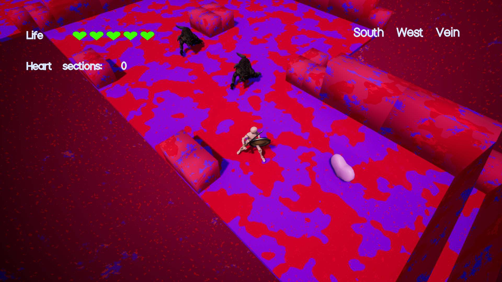

# Keep your heart beating

_Ludum Dare 46 - Theme: Keep it alive_

## Idea

Wild beasts appeared in your heart, they stole heart sections and escaped in the veins.

You have to go inside your heart to fight the beast and bring back the 4 heart sections in order to keep the heart beating.

## Controls

- Click on buttons with left mouse button
- Move your character with WASD or arrows or left stick from gamepad
- Attack with Q or left mouse button or gamepad right shoulder
- Defend with E or right mouse button or gamepad left shoulder (still no animation but it prevents taking damage)
- Pause with escape or del or start button from gamepad

_____________________
## TODO:

- **Goal:** pick up heart sections to keep your heart pumping
- top down isometric 3rd person (camera follow character in 1st prototype)
- you're inside the heart and have to bring back heart sections to the middle
- heart sections can be access through veins
- some enemies are blocking the veins
- 2 actions: attack (sword), guard (shield)
- life w/ hearts

### Init

- create empty project => ok
- create maps: menu => ok, playground => ok
- add main character (player controller  => ok, 3D asset => ok)
- add input from old project => ok
- attach camera to character (only movement, no rotation) => ok
- add hud script from old project => ok
- add hud widget and link life and pickup to character => ok
- add sword and shield assets => ok
- activate/deactivate bCanBeHit and bCanHit with animNotify => ok

### Next steps

- add pickups => ok
- create foe (wolf from infinity blade) => ok
- create ai (see old project + add nav mesh on floor) => ok
- add damage => ok
- audio sound effects (footsteps => ok, pickups => ok, impacts)
- create ludum dare account => ok
- create level01 map (sm_cubes with collisions for floor and walls, navmesh) => ok
- character orientation => ok
- enemy walk anim => ok
- add intro screen with explanations => ok
- add win screen => ok
- build game => ok
- upload game => ok

### Optional

- improve combat system => ok
- audio music: heart pumping sound => ok
- use plugin for lifebar => ok
- make fonts breath
- cel shading/ outline?
- add lights
- add fog of war
- wall invisible/transparent when player is behind (do it with inverted normals?) => ok (maybe better to use small cubes instead)
- add dash
- lock enemy

### Before Build

- change inputs to qwerty => ok

### Publish

- add credits => ok
- add screenshots => ok

### World assets
- Heart room (with entries) => ok
- vein straight lines (x2) => ok
- vein corners (x4) => ok
- vein T (x4) => ok
- vein U (x4) => ok
